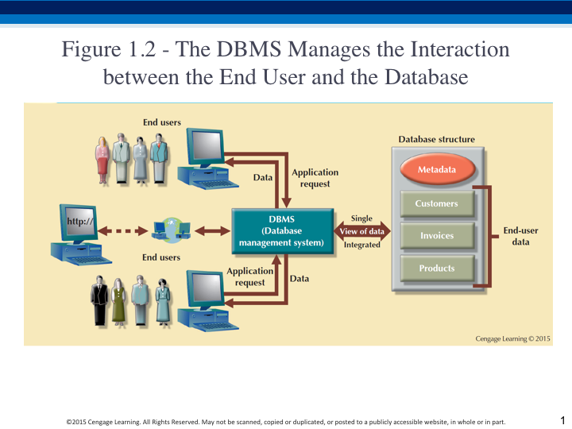
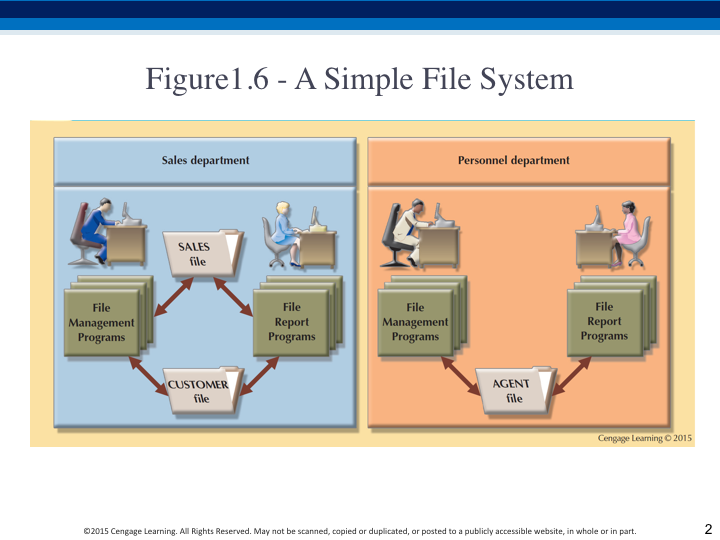
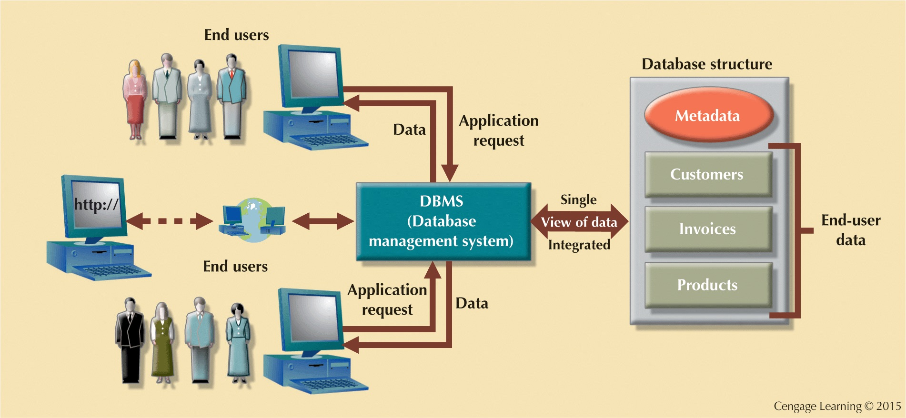
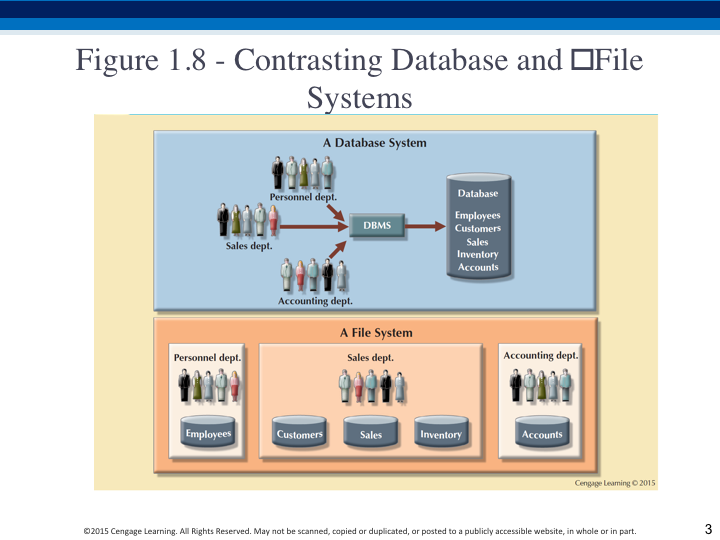

# Introduction

Lecture notes based on texts by Coronel, Widom, Ullman, and Silberschatz.

### Admin

Briefly discuss Logistics and expectations of undergrads and grads.

### Data or Information

**italics are discussion points**

_what's the difference?_

_what are examples of data?_

_what about examples of information?_

#### Data

- raw facts
- unprocessed data
- can't tell what it means or how to interpret/use it

#### Information

- result of processing data with some purpose in mind  
  - salary data and interest data become income information  
- can reveal the meaning of data  
  - temperature and humidity alone can't give you wind chill - you need wind speed  
- nonsense may be the result of combining data in unexpected ways  
  - trying to combine average low temperature and shoe size to predict the apple harvest  
  
### Why databases?

Discuss the "Horror Story" reading

### Databases to the rescue

Shared, integrated computer structure that stores a collection of:

- End-user data
  - Raw facts of interest to end user  
- Metadata: Data about data, which the end-user data are integrated and managed  
  - Describe data characteristics and relationships  
  

DBMS is a set of applications/tools, managing access and maintenance of the data in the DB

- between the users and the database/data
- mediates between users, data owners, and managers
- provides views into the data, without exposing complexity of HW/SW
- optimizes access when possible
  

_Ask students for examples of databases they have used._

Using a plain filesystem as a DB is unwieldy

- Aaron's problem
- File systems might use incompatible formats
- Duplication of data in different files/filesystems hard to detect and lead to anomalies of three types:  
    1. update anomalies  
    2. insertion anomalies  
    3. deletion anomalies  
  
- Duplication of data is also bad for security & privacy  
  - where are the data you want to protect or audit?  

- Different programs to access different sets of data
- "Atomicity" of updates is tough
- Access control is complicated
- Concurrency of access

    _Example: write on board_

    1. Alice and Bob have a joint account, both have ATM cards
    2. Shopping _separately_, both decide to get some cash
    3. Each visits an different ATM and checks the balance ($100) - each ATM receives her account status
    4. Each decides to withdraw $60, since clearly they have the funds.
    5. The first one to complete the transaction gets the cash, while the other either:
        - gets an "insufficient funds" error even though he/she had checked
        - gets the cash and the banks ends up charging them an overdraft fee

Advantages of DBMS - address all those problems

- Much improved data consistency, accuracy, timeliness
- Better access control, auditable, and consistent
- Anomaly detection
- Consistent, portable interface, even across networks
- **Safe:** DB's built to be safe against (1) From system failures (2) From malicious users
- **Convenient:** Simple commands to -- find a specific book, list all
    books in a certain category and price range, generate an order
    history, produce sales figures grouped by state, etc.

    _making unpredicted, or Ad Hoc, queries easy_

- **Efficient:** Don't search all files in order to
  - get price of one book,
  - get all customers from northern California,
  - get bestselling books from last week.

  *Massive data &rarr; DBMS's carefully tuned for performance*

Disadvantages of DBMS

- Higher costs
- Shifts complexity to management
- Vendor dependence (usually)
  - e.g., we'll be using mySQL which isn't 100% compatible with Oracle which isn't 100% compatible with Microsoft SQL Server which isn't 100% compatible with IBM's DB2
- Complex software like DBMS have updates and patches, while filesystems have far fewer

Kinds of databases

- Single or multi-user
- Enterprise or group
- Centralized or distributed (even to the Cloud)
- Operational vs. analytical (data warehouses)

#### Example database: online bookseller

Data = information on books (including categories, bestsellers, etc.),
customers, pending orders, order histories, trends and preferences, etc.

- **Massive:** hundreds of gigabytes at a minimum for medium-size online
    bookseller, and even more if
  - keep all order histories over all time,
  - keep clickstream logs,
  - keep images of book covers and sample pages

  _Far too big for memory_

- **Persistent:** data outlives programs that operate on it
- **Multi-user:** many people/programs accessing same database, or
    even same data, simultaneously

  _Need careful controls_

Appears similar to concurrent programming problems (synchronization,
semaphores, etc.)

- BUT: the data is not in main-memory variables, it's in a storage device

Appears similar to file system concurrent access

- BUT: want to control at smaller granularity

Also, databases may need to be distributed or replicated around the Internet

- for network performance 
- for load balancing
- for regulatory restrictions

---

#### Database history

- Early 50's and 60's
  - magnetic tapes
    - sequential only
    - updates required copy/rewrite
    - still used today for special situations (seismic DP, etc.)
- 60's - 70's
  - Hard disks allowed direct access to data
  - networking access began
- 1970 Edgar Codd made a breakthrough, defining the relational DB
  - See paper on Resources page
  - Won Turing award for it
  - Data Independence (between logical and physical implementations)
  - Concept of Normalization, used to avoid data anomolies
  - like redundancy, data loss, and integrity
  - Relational model and set-based query language like SQL
- 80's brought
  - full fledged SQL standard
  - Object-Oriented DB's
- 90's
  - Multi-terabyte Data warehouses enabling data mining
  - Web commerce
- 2000's
  - Data Lakes
    - A data lake is a vast pool of raw data, the purpose for which is not yet defined. "Just back up the truck..."
    - A data warehouse is a repository for structured, filtered data that has already been processed for a specific purpose.
    - If poorly managed, a data lake becomes a "data swamp".
  - XML representations arrived
  - NoSQL Alternatives to RDBMS, like MongoDB, Cassandra, Redis, CouchDB, and others.

#### Popular DB products

The [Stack Overflow Developer Survey Results 2024](https://survey.stackoverflow.co/2024/technology#1-programming-scripting-and-markup-languages) provides an interesting view into the SW development world.   Their description:

> Each year since 2011, Stack Overflow has asked developers about their favorite technologies, coding habits, and work preferences, as well as how they learn, share, and level up. This year represents the largest group of respondents in our history: over 70,000 developers took our annual survey in January.

Let's have a look at some of the report.

- SQL is only behind JSS for most popular programming language among professional developers
- MySQL was the favorite DB, over PostgresSQL and SQLite.
- MongoDB was the most popular NOSQL DB

##### Relational DB's

In addition to MySQL (managed by Oracle) there is:

- Postgres (Stonebraker, "Post Ingres", later winning Turing award)
- Oracle
- Microsoft: SQL Server, Access
- IBM: DB2, Informix

##### NoSQL DB's

Large-scale distributed DB system that stores structured and unstructured data in efficient ways.

- Mongo DB (document-oriented DB, most popular NOSQL DB)
- Redis (in-memory data structure store, used as a database, cache and message broker)
- CouchDB (key-value)
- Cassandra (hybrid key-value & column-oriented DB)
- Neo4j  (graph DB)

Towards the end of the course we will study these NOSQL databases, in general, and MongoDB in depth.

* * *
